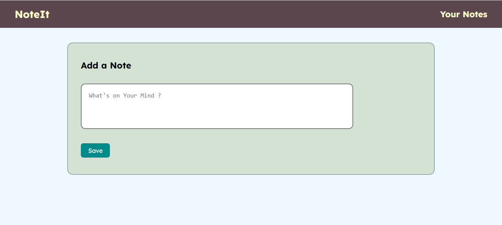

# Noteit - Note-Taking-App

NoteIt - A Note Taking App that allows users to add, edit, and delete notes, storing them in the browser's localStorage for persistence across sessions. The interface includes an input field, an "Add Note" button, and a list displaying notes with "Edit" and "Delete" buttons. Notes are dynamically updated and saved, ensuring data is retained even after refreshing or closing the browser.

Additionally, the Navbar includes a link labeled 'Your Notes' which, when clicked, navigates to the section where notes are displayed.